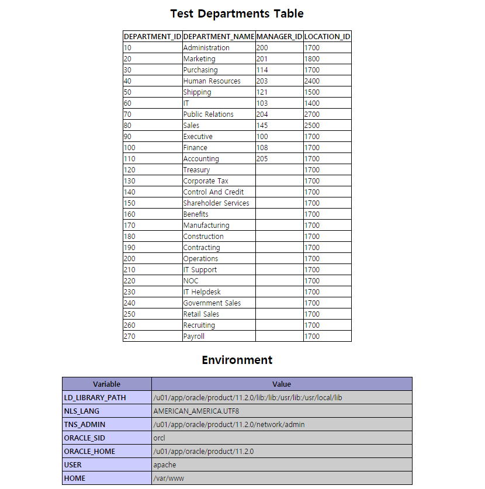

date: 2016-03-24 00:00:00
title: Php-fpm, Nginx, Oracle
layout: post
tags: ['oracle','php','nginx']

OEL6(Oracle Enterprise Linux 6)에 Oracle이 설치된 환경에서

**한 로컬 서버에** Oracle, Nginx, Php-fpm 모두를 설치하는 과정입니다.

- - -

## oracle 유저를 wheel 그룹에 속하게 하기

**sudo** 명령어로 루트 권한을 이용할 수 있는 wheel 그룹을 oracle 유저에게 부여합니다.

먼저, /etc/sudoer 파일에서 wheel 그룹의 주석을 해제합니다.

```bash
chmod 777 /etc/sudoers

vi /etc/sudoers
### wheel 주석 해제 부분
%wheel  ALL=(ALL)   ALL
###

chmod 440 /etc/sudoers
ll /etc/sudoers
```

<div class="warn">
마지막에 권한을 440 (읽기 전용)으로 꼭 바꾸어 주어야 합니다.
이를 하지 않으면 부팅이 되지 않습니다.
</div>

oracle 유저에게 wheel 권한을 추가해 줍니다.

```bash
usermod -a -G wheel oracle
```

- - -

## 방화벽에 포트 추가 및 SELinux 설정
```bash
# /etc/nginx/sites-available/app 의 listen 에 설정한 포트를 추가합니다.
vi /etc/sysconfig/iptables
### COMMIT 위에 추가
-A INPUT -m state --state NEW,ESTABLISHED -m tcp -p tcp --dport 80 -j ACCEPT
###

service iptables restart

# SELinux가 enforcing mode 일 경우 외부에서 접속 시 TNS-12546: Permission Denied 오류가 발생할 수 있습니다.
vi /etc/selinux/config
### Permissive mode 는 rule 에 어긋나는 동작이 있을 경우 audit log 를 남기고 해당 operation 은 허용됩니다.
SELINUX=permissive
###
reboot
```

```bash
# 웹서버가 동작 할 때만 SELinux를 켤 수 있습니다.
setenforce [enforcing | permissive | 1 | 0]
sestatus
```
[SELinux log 확인 방법](https://wiki.gentoo.org/wiki/SELinux/Tutorials/Where_to_find_SELinux_permission_denial_details)

- - -

## Nginx 웹서버 설치

```
# RedHat
baseurl=http://nginx.org/packages/rhel/$releasever/$basearch/

# CentOS
baseurl=http://nginx.org/packages/centos/$releasever/$basearch/
```

<div class="def">
위 주소를 권장하지만 인식을 하지 않는 경우가 있어 정확한 주소를 기입하였습니다. <br>

여기서는 64bit 환경에 /etc/redhat-release 버전이 6.x 이므로 아래처럼 주소를 사용했습니다.
</div>

```ini
vi /etc/yum.repos.d/nginx.repo
###
[nginx]
name=nginx repo
baseurl=http://nginx.org/packages/rhel/6/x86_64/
gpgcheck=0
enabled=1
###

yum install -y nginx
```

설치가 되면 다음 두 폴더를 만듭니다.

```bash
mkdir /etc/nginx/sites-enabled
mkdir /etc/nginx/sites-available
```

nginx.conf의 http 블록 영역 안에 아래와 같이 추가합니다.

```nginx
vi /etc/nginx/nginx.conf
### (APPEND http block)
# include /etc/nginx/conf.d/*.conf; 주석 처리
include /etc/nginx/sites-enabled/*;
# character set
charset UTF-8;
###
```

작업 디렉터리와 심볼릭 링크를 만듭니다.

```bash
mkdir /var/www/public
chown oracle:oinstall /var/www/public

# public -> /var/www/public
ln -s /var/www/public /u01/public
chown -h oracle:oinstall /u01/public
```

- - -

## App 추가

/etc/nginx/conf.d/default.conf 파일에서 필요한 부분만 새로 만들어주고 이에 심볼릭 링크를 걸어줍니다.

```nginx
vi /etc/nginx/sites-available/app
###
server {
  listen 80;
  server_name _;

  root /var/www/public;

  access_log /var/log/nginx/app.access.log;
  error_log /var/log/nginx/app.error.log;

  location / {
    include /etc/nginx/conf.d/php-fpm;
    index index.php index.html index.htm;
    try_files $uri $uri/ /index.php?$query_string;
  }
}
###
```

```nginx
vi /etc/nginx/conf.d/php-fpm
###
location ~ \.php$ {
  try_files $uri = 404;
  fastcgi_pass 127.0.0.1:9000;
  fastcgi_index index.php;
  fastcgi_param SCRIPT_FILENAME $document_root$fastcgi_script_name;
  include fastcgi_params;
}
###

# /etc/nginx/sites-enabled/app -> /etc/nginx/sites-available/app
ln -s /etc/nginx/sites-available/app /etc/nginx/sites-enabled/
```

- - -

## PHP 설치

php 5.6의 최신버전을 설치하기 위해 다음 미러주소를 통해

php와 php-fpm을 설치합니다.


```bash
## 64 bit Enterprise Linux 6
rpm -Uvh http://mirror.webtatic.com/yum/el6/latest.rpm

yum install -y php56w php56w-opcache php56w-fpm php56w-devel
```

다음을 실행하여 app에서 설정한 80번 포트와 php-fpm의 9000 포트가 뜬다면 성공한 것입니다.

```bash
service nginx start
service php-fpm start

netstat -an | grep "LISTEN "

###
...
tcp        0      0 127.0.0.1:9000              0.0.0.0:*                   LISTEN
tcp        0      0 0.0.0.0:80                  0.0.0.0:*                   LISTEN
...
###
```

- - -

## 작업 디렉터리에서 테스트

앞에서 작업 디렉터리를 /u01/public으로 만들었습니다.

```php
su - oracle
cd public

vi index.php
###
<?php
print 'hello!';
?>
###
```

여기서 http://localhost 로 접속이 되면 성공한 것입니다.

- - -

## instant client 패키지 설치

[oracle instant client 다운로드](http://www.oracle.com/technetwork/database/features/instant-client/index-097480.html) 홈페이지로 들어가서
해당 OS와 Oracle 버전에 맞는 instant client를 다운로드 합니다.

```
Instant Client for Linux x86-64
Version 11.2.0.4.0
  # Instant Client Package - Basic:
  oracle-instantclient11.2-basic-11.2.0.4.0-1.x86_64.rpm

  # Instant Client Package - SDK:
  oracle-instantclient11.2-devel-11.2.0.4.0-1.x86_64.rpm
```

rpm 패키지를 설치합니다.

```bash
cd ~/Downloads

cksum oracle-instantclient11.2-*
rpm -Uvh oracle-instantclient11.2-*
```

- - -

## OCI8 module 설치

php -v 명령을 이용하여 php 버전을 확인하고
해당 버전에 맞는 oci8 module을 [다운로드](http://pecl.php.net/package/oci8)합니다.

아래 명령어로 압축을 풀고 컴파일 합니다.

<div class="warn">
로컬에 오라클이 깔려있을 경우와 아닌 경우의 configure 옵션이 다릅니다.<br>
자세한 내용은 <a href="http://php.net/manual/en/oci8.installation.php" style="color:cyan">PHP 홈페이지</a>를 참조하세요.
</div>

```bash
# oci8-2.0.10
wget http://pecl.php.net/get/oci8-2.0.10.tgz

tar xvzf oci8-2.0.10.tgz --directory=/u01

su - oracle
cd /u01/oci8-2.0.10

sudo phpize

sudo ./configure --with-oci8=shared,$ORACLE_HOME

sudo make
sudo make install
```

<div class="def">
$ORACLE_HOME 경로를 정확히 표기하면 oracle 유저로 접속할 필요가 없습니다.<br>
아래부터는 다시 root로 접속하여 진행합니다.
</div>

- - -

## php 설정

/etc/php.ini 에서 다음과 같이 내용을 수정합니다.

```ini
vi /etc/php.ini
###
;;;;;;;;;;;;;;;;;;;;;;;;;;;;;;
; Error handling and logging ;
;;;;;;;;;;;;;;;;;;;;;;;;;;;;;;
; :452
; E_ALL | E_STRICT (Show all errors, warnings and notices including coding standards.)
error_reporting = E_ALL | E_STRICT

; :469
display_errors = On

;;;;;;;;;;;;;;;;;;;
; Module Settings ;
;;;;;;;;;;;;;;;;;;;

; :889
date.timezone = Asia/Seoul

;;;;;;;;;;;;;;;;;;;;;;
; Dynamic Extensions ;
;;;;;;;;;;;;;;;;;;;;;;

; :1204
[OCI8]
extension=oci8.so
extension_dir=/usr/lib64/php/modules
###
```

- - -

## Oracle 환경변수 추가

```ini
vi /etc/php-fpm.d/www.conf
; :200
env[ORACLE_HOME] = /u01/app/oracle/product/11.2.0
env[ORACLE_SID] = orcl
env[TNS_ADMIN] = /u01/app/oracle/product/11.2.0/network/admin
env[NLS_LANG] = AMERICAN_AMERICA.UTF8
env[LD_LIBRARY_PATH] = /u01/app/oracle/product/11.2.0/lib:/lib:/usr/lib:/usr/local/lib
```

설정을 변경하였으면 서비스를 다시 시작합니다.

```bash
service nginx restart
service php-fpm restart
```

- - -

## Database Startup, Listener Start

데이터베이스가 Open 상태인지, 리스너가 켜져 있는지 확인합니다.

```sql
sqlplus / as sysdba

SELECT status FROM v$instance
/
-- Database Not Open
STARTUP

!LSNRCTL status
-- Listener Not Start
!LSNRCTL START
```

- - -

## Database 접속을 테스트

/u01/public/index.php를 아래와 같이 수정합니다.

```php
<?php header("content-type: text/html; charset=UTF8");
print "<h2 style='text-align:center'> Test Departments Table</h2>\n";

$conn = oci_connect('hr', 'hr', 'localhost/orcl', 'AL32UTF8');
if (!$conn) {
    $e = oci_error();
    trigger_error(htmlentities($e['message'], ENT_QUOTES), E_USER_ERROR);
}

// Prepare the statement
$stid = oci_parse($conn, 'SELECT * FROM departments');
if (!$stid) {
    $e = oci_error($conn);
    trigger_error(htmlentities($e['message'], ENT_QUOTES), E_USER_ERROR);
}

// Perform the logic of the query
$r = oci_execute($stid);
if (!$r) {
    $e = oci_error($stid);
    trigger_error(htmlentities($e['message'], ENT_QUOTES), E_USER_ERROR);
}

// Fetch the results of the query
print "<table border='1' style='margin:auto'>\n";

print "<tr><th>DEPARTMENT_ID</th>
<th>DEPARTMENT_NAME</th>
<th>MANAGER_ID</th>
<th>LOCATION_ID</th></tr>\n";

while ($row = oci_fetch_array($stid, OCI_ASSOC+OCI_RETURN_NULLS)) {
    print "<tr>\n";
    foreach ($row as $item) {
        print "    <td>" . ($item !== null ? htmlentities($item, ENT_QUOTES) : "&nbsp;") . "</td>\n";
    }
    print "</tr>\n";
}
print "</table>\n";

oci_free_statement($stid);
oci_close($conn);

phpinfo(INFO_ENVIRONMENT);

?>
```

아래와 같은 화면이 뜨면 성공입니다 !



- - -

## REFERENCE

[http://php.net/manual/en/book.oci8.php](http://php.net/manual/en/book.oci8.php)

[PDF - The Understand PHP and Oracle Manual](http://www.oracle.com/technetwork/database/database-technologies/php/201212-ug-php-oracle-1884760.pdf)
