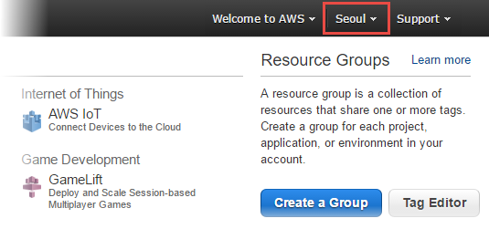
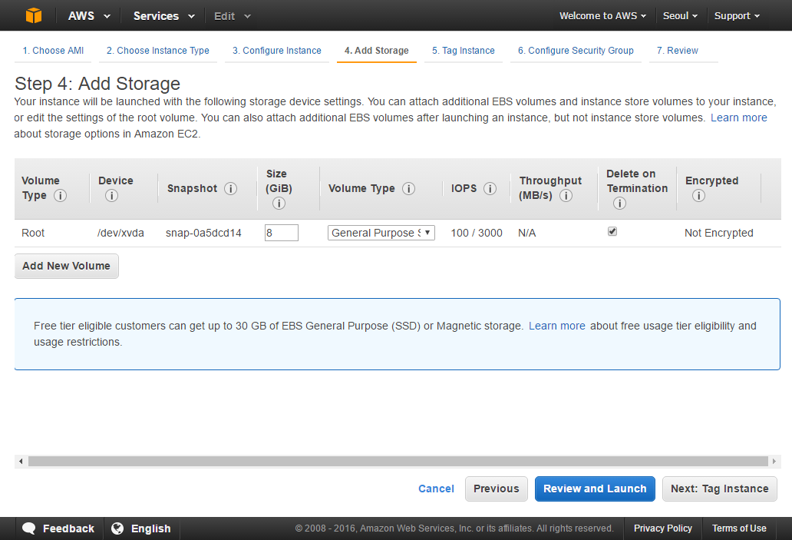
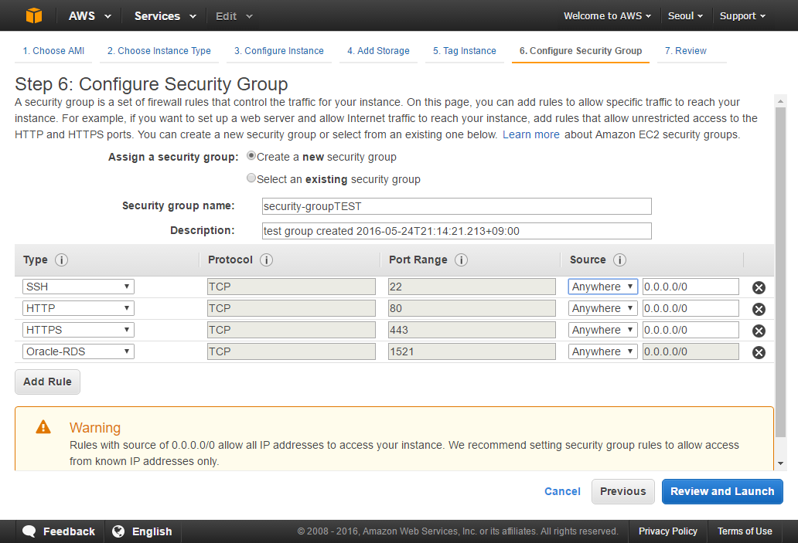
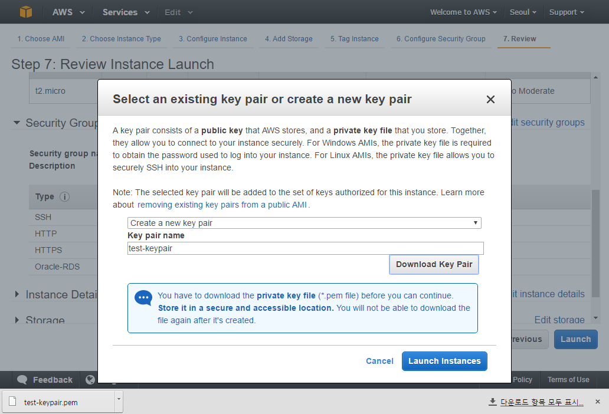
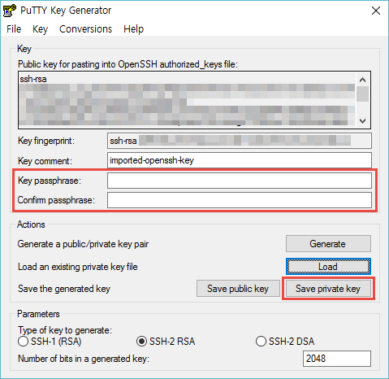
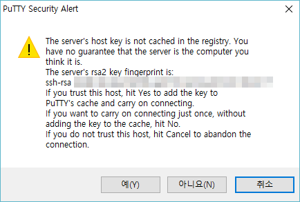
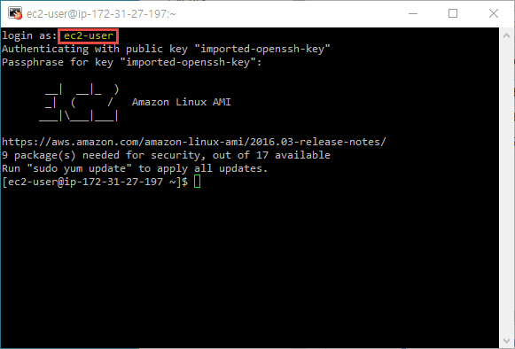

date: 2016-05-24 00:00:00
layout: post
title: AWS 프리티어 EC2
tags: ['aws','ec2']

[AWS 프리티어 주요제품](//aws.amazon.com/ko/free)

아마존 웹서비스 주요제품은 위 링크에 있으며 제가 사용하는 제품군은 EC2, RDS입니다.

만약 요금이 청구되었다면 위 웹페이지의 조건을 어긴것이므로 사용을 고려하실경우 신중하게 선택하세요.

처음 사용시에 오른쪽 위의 지역선택 항목에 유의해야합니다.

인스턴스가 없어진게 아니라 다른 지역이기 때문일 수도 있습니다.

---

## EC2 인스턴스 생성

먼저 EC2제품을 선택하여 Create Instance 항목의 Launch Instance를 클릭합니다.

저는 Quick Start 항목의 Amazon Linux를 선택하였습니다.

CentOS같은 경우 Quick Start항목에는 나와있지 않지만 프리티어 조건에 따라 t2.micro라는 인스턴스를 사용한다면 가능합니다.

Configure Instance Details 단계에서 저는 기본적인 옵션을 두고 다음단계로 넘어갔지만 여기서 네트워크 설정 및 인스턴스를 Shared 방식으로 할지 Dedicated 방식으로 할지 결정할 수 있습니다.

자세한 내용은 마우스를 올려서 확인할 수 있습니다.

스토리지는 SSD 30GB 까지 사용할 수 있다고 친절하게 설명되어 있습니다.

계획에 맞게 용량을 선택합니다.

저는 RDS를 따로 사용할 것이기 때문에 많은 용량은 필요없어서 하나의 볼륨만 기본 8GB로 잡았습니다.

인스턴스에 대한 태그를 지정합니다. 설명에서 예로 든 것처럼 key : value를 ec2-user : webserver로 하였습니다.

생성할 인스턴스의 방화벽에서 인바운드 규칙을 적용하는 것과 같습니다. 포트를 열어 인스턴스와 통신할 수 있게 합니다.

php를 nginx서버로 연결하기 위해 HTTP HTTPS에 해당하는 80번 443번 포트와

Oracle-RDS를 연결하기 위해 기본 리스너 포트인 1521

SSH로 인스턴스를 연결하기 위한 22번 포트를 열어줍니다.

이것은 모두 기본 포트이므로 사용자 설정에 맞게 포트를 정하고 따로 사용하시면 됩니다.

---

## SSH 연결

인스턴스와 통신을 하기 위해 인스턴스에 key pair를 등록합니다.

해당 keypair를 로컬 컴퓨터에도 다운로드 합니다.

이를 이용해서 SSH 접속을 할 계획입니다.

Connect 버튼을 클릭하시면 SSH 연결하는 방법을 설명해줍니다.

리눅스나 맥 환경은 친절하게 설명이 되어있지만

저는 Windows 환경이므로 따로 [문서](//docs.aws.amazon.com/console/ec2/instances/connect/putty)화 되어있는 putty 설정을 통해 SSH 접속을 합니다.

다운로드된 Private key file은 리눅스용인 pem파일입니다. 저는 putty를 이용하여 접속할 것이기 때문에 ppk파일로 바꾸어 주어야 합니다.

......

[putty와 puttygen를 다운로드](//www.chiark.greenend.org.uk/~sgtatham/putty/download.html/)합니다.

먼저 puttygen에서 Load를 눌러 키를 불러온 다음 비밀번호를 입력하고 Save private key를 눌러 ppk파일로 저장합니다.

putty를 실행하여 Connection - SSH - Auth 항목의 Private key file for authentication란에 **생성한 ppk파일** 을 넣습니다.

Session 항목의 Host Name란에 생성된 **인스턴스의 public IP 주소** 를 적고, Security Group의 SSH 설정을 통해 열어주었던 22번 포트로 접속합니다.

Amazon Linux는 ec2-user로 로그인합니다.

생성시 만든 비밀번호를 입력합니다.

다음과 같은 화면이 뜬다면 성공한 것입니다.

